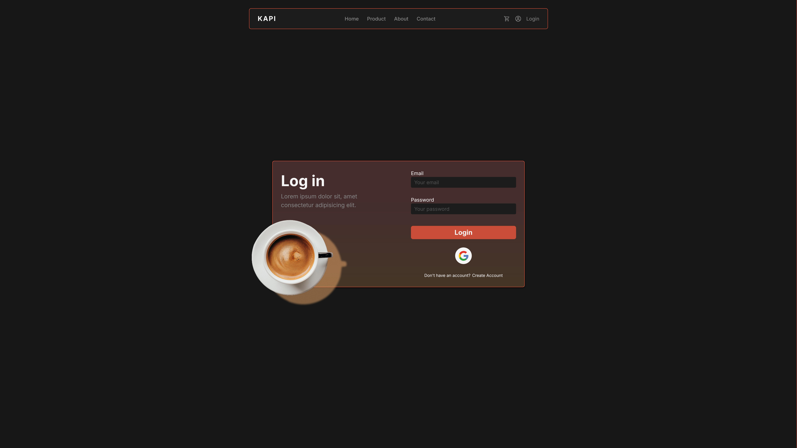
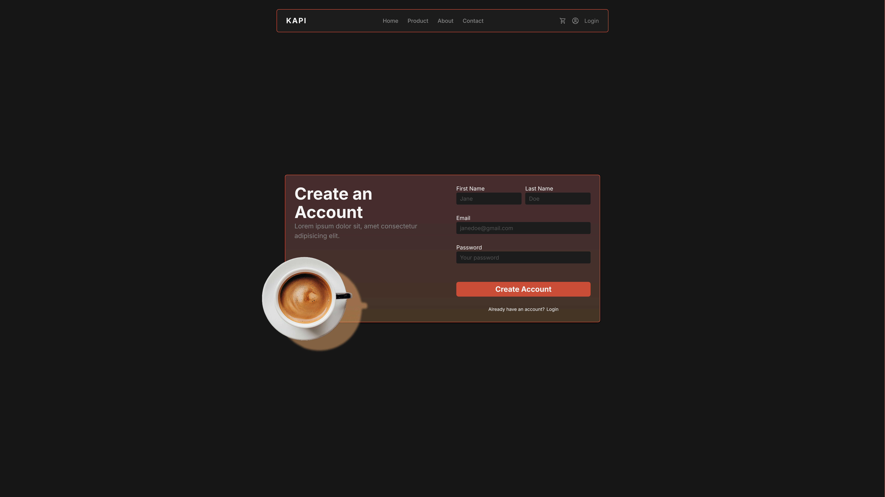
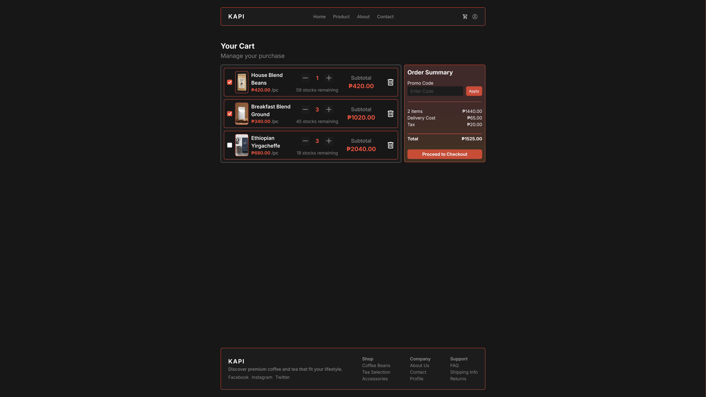
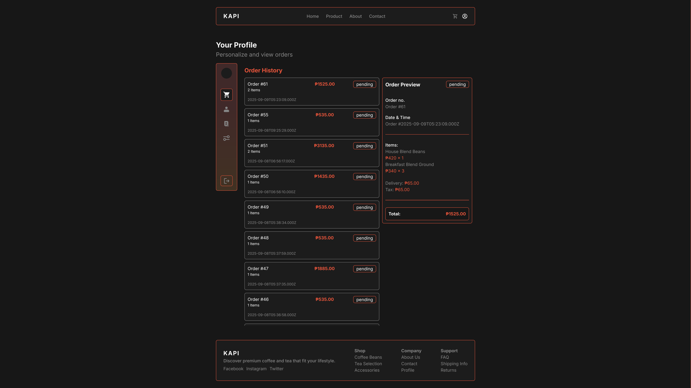
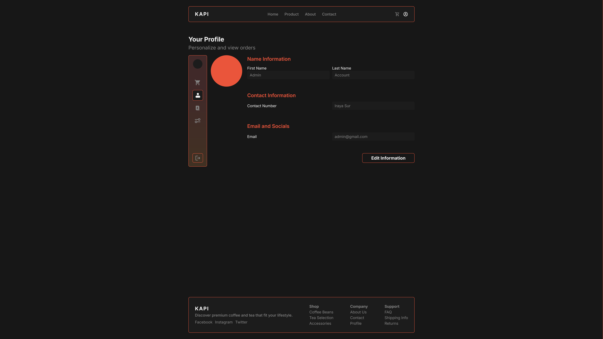
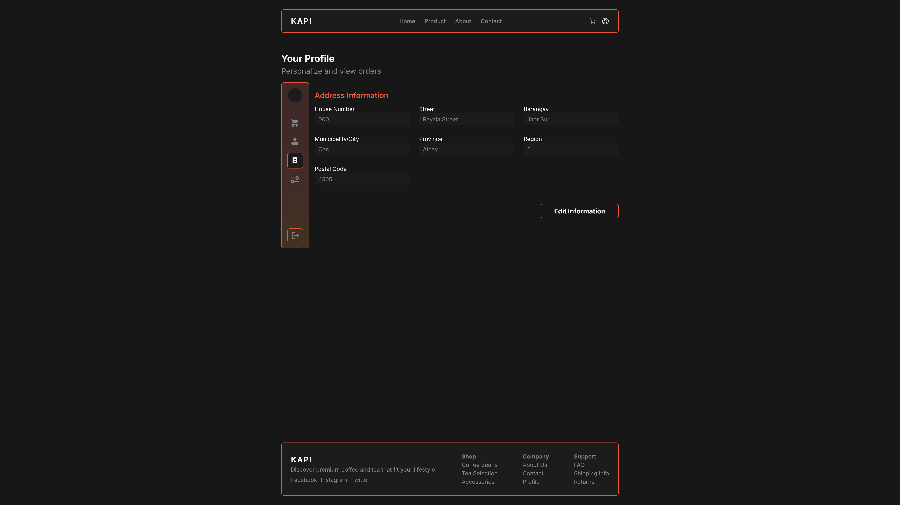

# Kapi E-Commerce

**A React-based e-commerce platform (Customer Side)**  

This repository is a practice full-stack project for building an e-commerce platform called Kapi.
The goal is to simulate an online store experience and practice working with React (frontend), Node.js/Express (backend), and MySQL (database).

Project Description:
Kapi is designed as a sample coffee e-commerce website, where users can browse products, add items to a cart, and manage their profiles.
The project serves as a playground for learning modern full-stack development, experimenting with UI/UX design, and practicing database integration.

  

## ✨ Features  

- **Login / Signup** – Authentication system for account creation and secure login.  
  
 

- **Home** – Landing page with product highlights, categories, and promotions.  
  
  

- **Product** – Browse products with **filters, search, and sorting** for a seamless shopping experience.  
    

- **Cart** – View, update, or remove items before checkout.  
  

- **Checkout** – Secure checkout process with order summary and payment options.  
    

- **Order History** – Track past orders with details and status updates.  
  

- **Profile & Address Settings** – Manage personal information, shipping addresses, and account preferences.  
  
  
